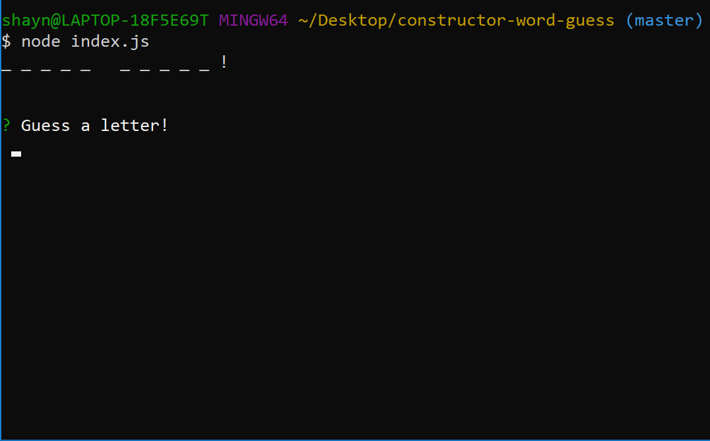

# Constructor-Word-Guess

## About

This is a command line interface hangman game. A random word is pulled from an array of [>200 difficult-to-guess words](https://www.hangmanwords.com/words), then each letter is represented by an underscore on the terminal. When a letter is guessed correctly, that letter is revealed in the string (replacing the underscore previously in its place), until the string is complete. When there are no underscores remaining, the player wins and is offered a rematch with a new word to guess.

If the player guesses incorrectly, the number of allotted guesses is decremented and shown on screen. If the player runs out of guesses the game is lost, and again a rematch is offered.

If the user guesses the same letter repeatedly, the remaining guessses aren't decremented and a message is displayed saying that the letter has already been guessed. Similarly, if anything other than a character is entered (punctuation, numbers, multiple characters, an empty string, a space, etc) the number of remaining guesses is not decremented, and a message is displayed to the player telling them their input was invalid.

## Thanks

Thank you for checking out this CLI hangman game :-)